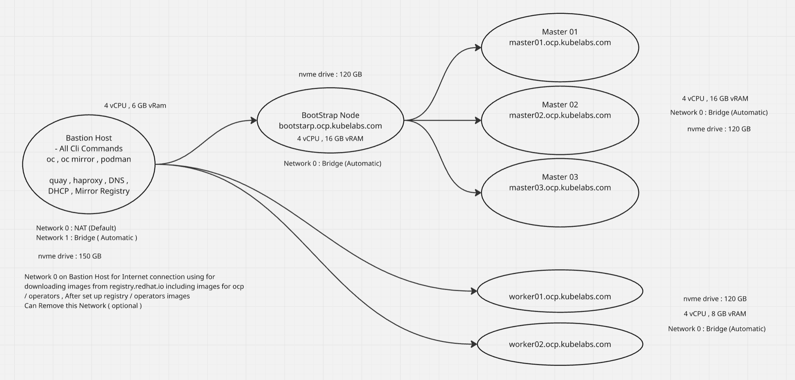
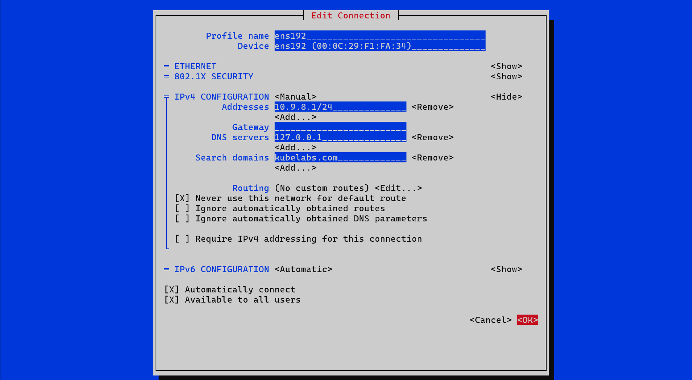
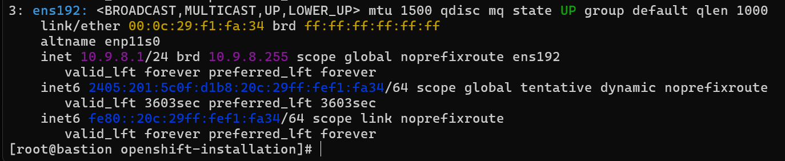
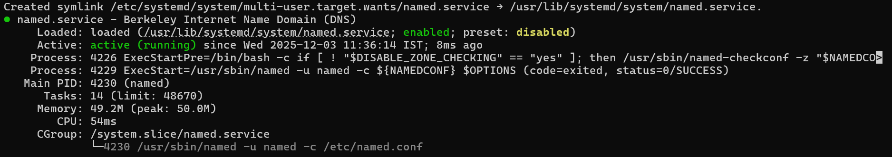
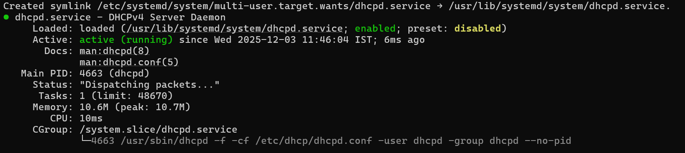
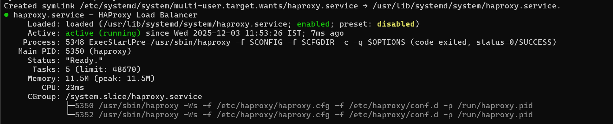

# OpenShift Install

The OpenShift installer `openshift-install` makes it easy to get a cluster
running on the public cloud or your local infrastructure.

To learn more about installing OpenShift, visit [docs.openshift.com](https://docs.openshift.com)
and select the version of OpenShift you are using.

This project documents a **fully disconnected OpenShift 4.18 deployment** running on  
**VMware Workstation Pro 25H2** hosted on **Windows 11 Home Edition**.  
All required cluster artifacts—RHCOS ISO, release images, and operator catalogs—are mirrored and consumed locally without any external network access.

---

## 📌 Prerequisites

### **Infrastructure Requirements**

| Component        | vCPU | Memory        | Description |
|-----------------|------|----------------|-------------|
| **Bastion Host**  | 4    | 8 GB RAM       | Hosts mirror registry, DNS, DHCP, HAProxy, and CLI tools |
| **Bootstrap Node**| 4    | 16 GB RAM      | Temporary bootstrap node for initializing the control plane |
| **Master Nodes** (x3) | 4 each | 16 GB RAM each | OpenShift control plane nodes |
| **Worker Nodes** (x2 or more) | 4 each | 8–16 GB RAM | Application and workload nodes |

---

## 📌 Software Requirements

- **RHEL CoreOS 4.18 ISO**
- **OpenShift CLI (`oc`)**
- **`oc-mirror` CLI** for disconnected mirroring
- **`openshift-install` binary**
- Local **registry** for hosting mirrored release and operator images

---

## 📌 Architecture Diagram

---

## 📌 Components Overview

### **1. Bastion Host (Central Management & Mirror Node)**  
The Bastion host is the backbone of this disconnected environment and provides:

- OpenShift CLI tools: `oc`, `oc-mirror`, Podman  
- Quay / Mirror Registry for hosting all OCP & operator images  
- HAProxy load balancer  
- DNS server for cluster name resolution  
- DHCP server (optional)

**Hardware Specs**
- 4 vCPU  
- 6–8 GB vRAM  
- 150 GB NVMe disk  

**Networking**
- **Network 0: NAT** → Used only to download Red Hat images (optional)  
- **Network 1: Bridge** → Production cluster network  

After mirroring images, NAT can be removed.

---

### **2. Bootstrap Node**  
Temporary node used during cluster bring-up.

**Hardware Specs**
- 4 vCPU  
- 16 GB vRAM  
- 120 GB NVMe  

**Network**
- Bridge (Automatic)

---

### **3. Master Nodes (Control Plane)**  
Nodes hosting API server, etcd, scheduler, controller-manager.

**Hardware Specs (each)**
- 4 vCPU  
- 16 GB vRAM  
- 120 GB NVMe  
- Bridge Network  

Hostnames:
- `master01.kubelabs.com`
- `master02.kubelabs.com`
- `master03.kubelabs.com`

---

### **4. Worker Nodes**  
Run workloads, ingress routers, monitoring stack, application pods.

**Hardware Specs**
- 4 vCPU  
- 8–16 GB vRAM  
- 120 GB NVMe  
- Bridge Network  

Hostnames:
- `worker01.kubelabs.com`
- `worker02.kubelabs.com`

---

## 📌 Network Flow Summary

1. **Bastion Host → Bootstrap Node**  
   Provides ignition configs, registry, DNS, and load balancing.

2. **Bootstrap Node → Master Nodes**  
   Brings up the control plane components.

3. **Master Nodes → Worker Nodes**  
   Workers join using ignition files served by the Bastion.

4. After bootstrap completion, the **Bootstrap Node is removed**.

---

## Part A : Bastion Host Configuration 

### Step 1 : Copy the Git repository to the Linux host, download the required CLI tool packages, extract them using tar xzvf <tarball.tar.gz>, and move the binaries to /usr/bin/ for system-wide access. 
~~~
$ git clone https://github.com/Deepak-Das01/openshift-installation.git
$ cd cli-tools/
$ wget https://mirror.openshift.com/pub/openshift-v4/x86_64/clients/ocp/4.18.X/openshift-client-linux-4.18.X.tar.gz 
$ wget https://mirror.openshift.com/pub/openshift-v4/x86_64/clients/ocp/4.18.X/openshift-install-linux.tar.gz 
$ wget https://mirror.openshift.com/pub/openshift-v4/x86_64/clients/ocp/4.18.X/oc-mirror.rhel9.tar.gz
~~~
### Step 2  : Network Configuration on Virtual machine host use the Networ 1 ( Bridge ) in my case its ens194 on the host machine and change its ipv4 address to the 10.9.8.1/24 , dns 127.0.0.1 , Search domains : kubelabs.com 
1. edit using below command and choose you bridge network
~~~
nmtui-edit con ens192
~~~

2. Change the ipv4 to maunal and edit the details as per the below snip after that click on save 

3. To confirm ip is allocated or not run below commands and verify 
~~~
$ nmcli connection down ens192
$ nmcli connection up ens192
$ ip a
~~~

### Step 3 : Turn Off the Firewall service 
~~~
[root@bastion openshift-installation]# systemctl stop firewalld
[root@bastion openshift-installation]# systemctl disable firewalld
~~~

### Step 4 : Set up dns ( Named )
~~~
$ dnf install bind bind-utils -y

[root@bastion openshift-installation]# ls
cli-tools  dhcp  dns  haproxy  install-config.yaml  README.md
[root@bastion openshift-installation]# cp -r dns/named.conf /etc/named.conf
[root@bastion openshift-installation]# cp -R dns/zones/ /etc/named/
systemctl enable named
systemctl start named
systemctl status named
~~~

### Confirm every thing is working fine 
~~~
[root@bastion openshift-installation]# dig -x 10.9.8.1

; <<>> DiG 9.16.23-RH <<>> -x 10.9.8.1
;; global options: +cmd
;; Got answer:
;; ->>HEADER<<- opcode: QUERY, status: NOERROR, id: 53699
;; flags: qr aa rd ra; QUERY: 1, ANSWER: 4, AUTHORITY: 0, ADDITIONAL: 1

;; OPT PSEUDOSECTION:
; EDNS: version: 0, flags:; udp: 1232
; COOKIE: 9650ac3ba550bb8c01000000692fd49550c7e925950da5b5 (good)
;; QUESTION SECTION:
;1.8.9.10.in-addr.arpa.         IN      PTR

;; ANSWER SECTION:
1.8.9.10.in-addr.arpa.  604800  IN      PTR     api.ocp.kubelabs.com.
1.8.9.10.in-addr.arpa.  604800  IN      PTR     api-int.ocp.kubelabs.com.
1.8.9.10.in-addr.arpa.  604800  IN      PTR     bastion.kubelabs.com.
1.8.9.10.in-addr.arpa.  604800  IN      PTR     registry.kubelabs.com.

;; Query time: 1 msec
;; SERVER: 127.0.0.1#53(127.0.0.1)
;; WHEN: Wed Dec 03 11:41:33 IST 2025
;; MSG SIZE  rcvd: 191
~~~

### Step 5 : Setup dhcp
~~~
$ dnf install dhcp-server -y
[root@bastion openshift-installation]# cp dhcp/dhcpd.conf /etc/dhcp/dhcpd.conf
systemctl enable dhcpd
systemctl start dhcpd
systemctl status dhcpd
~~~

### Step 6 : Install & configure Apache Web Server
~~~
$ dnf install httpd -y
$ sed -i 's/Listen 80/Listen 0.0.0.0:8080/' /etc/httpd/conf/httpd.conf
systemctl enable httpd
systemctl start httpd
systemctl status httpd
~~~
### to check the service is working fine on port 8080
~~~
$ curl localhost:8080
~~~
### Step 7 : Install & configure HAProxy Load Balancer
~~~
$ dnf install haproxy -y
[root@bastion openshift-installation]# cp haproxy/haproxy.cfg /etc/haproxy/haproxy.cfg
setsebool -P haproxy_connect_any 1 # SELinux name_bind access
systemctl enable haproxy
systemctl start haproxy
systemctl status haproxy
~~~

### Step 8 : Setup and enable nfs for internal image registry
~~~
[root@bastion openshift-installation]# mkdir -p /root/nfs-registry
[root@bastion openshift-installation]# chown -R nobody:nobody /root/nfs-registry
[root@bastion openshift-installation]# chmod -R 777 /root/nfs-registry
[root@bastion openshift-installation]# echo "/root/nfs-registry  10.9.8.0/24(rw,sync,root_squash,no_subtree_check,no_wdelay)" > /etc/exports
[root@bastion openshift-installation]# exportfs -rv
exporting 10.9.8.0/24:/root/nfs-registry
[root@bastion openshift-installation]# systemctl enable nfs-server rpcbind
systemctl start nfs-server rpcbind nfs-mountd
Created symlink /etc/systemd/system/multi-user.target.wants/nfs-server.service → /usr/lib/systemd/system/nfs-server.service.
~~~
---

## Part B : Setup Mirror Registry in bastion host
### Step 9 : Create hosts entry in /etc/hosts file ( If DNS Already done then skip this step )
~~~
[root@bastion ~]# cat /etc/hosts
127.0.0.1   localhost localhost.localdomain localhost4 localhost4.localdomain4
::1         localhost localhost.localdomain localhost6 localhost6.localdomain6
 
192.168.29.83   bastion.kubelabs.com
~~~
### Step 10 : Export all the variables required for mirror the ocp images , Pull secret need to generate from the Redhat Hybrid cloud console 
~~~
export OCP_RELEASE=4.18.24
export ARCHITECTURE=x86_64
export PULL_SECRET_PATH=/root/pullsec/pull-secret.txt
export SAVE_DIR=/root/images
~~~
Ensure the directory exists $ variables are working 
~~~
mkdir -p $SAVE_DIR
~~~
### Step 11 : Run Below Command To Download The Image Files OCP Platform 4.18
~~~
oc adm release mirror -a ${PULL_SECRET_PATH}   --from=quay.io/openshift-release-dev/ocp-release:${OCP_RELEASE}-${ARCHITECTURE}   --to-dir=${SAVE_DIR}
~~~
This Command is only successful only if it presents 
~~~
sha256:bfb892b741b3309e593a21eb9affa4b5348f5327bea99e7a44c7d4ba8d6a6f90 file://openshift/release:4.16.5-x86_64-azure-workload-identity-webhook
info: Mirroring completed in 14m4.05s (3.848MB/s)
 
Success
Update image:  openshift/release:4.16.5-x86_64
 
To upload local images to a registry, run:
 
    oc image mirror --from-dir=/ocp-image 'file://openshift/release:4.16.5-x86_64*' REGISTRY/REPOSITORY
 
Configmap signature file /ocp-image/config/signature-sha256-ac78ebf77f95ab8f.json created
~~~
### Step 12 : Install Quay Mirror Registry 
Downalod the cli tool using below link
~~~
$ wget https://mirror.openshift.com/pub/cgw/mirror-registry/latest/mirror-registry-amd64.tar.gz
~~~
### Step 13 : Untar the tarball file and run the below command , User name and password are your choice
~~~
./mirror-registry install --quayHostname bastion.ocplabs.com --initUser openshift --initPassword redhat123
~~~
This Command is only successful only if it presents 
~~~
PLAY RECAP ************************************************************************************************************************************************************************
root@bastion.ocplabs.com   : ok=48   changed=19   unreachable=0    failed=0    skipped=16   rescued=0    ignored=0
 
INFO[2025-07-10 02:37:34] Quay installed successfully, config data is stored in ~/quay-install
INFO[2025-07-10 02:37:34] Quay is available at https://bastion.ocplabs.com:8443 with credentials (openshift, redhat123)
~~~
